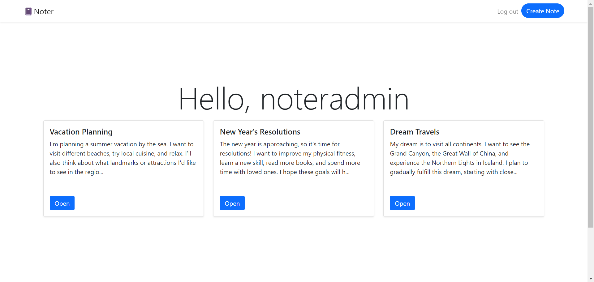

# Noter
### Screenshot

### Description
Noter is a simple noting app using advanced text editor
### Tech stack
- Django
- Bootstrap 5
- CKEditor

### Installation
```powershell
./venv/Scripts/activate
```

```powershell
cd Noter
```

```powershell
python -m manage runserver
```

```powershell
start http://127.0.0.1:8000/
```

### Passwords
- admin
  - login: noteradmin
  - password: 123
